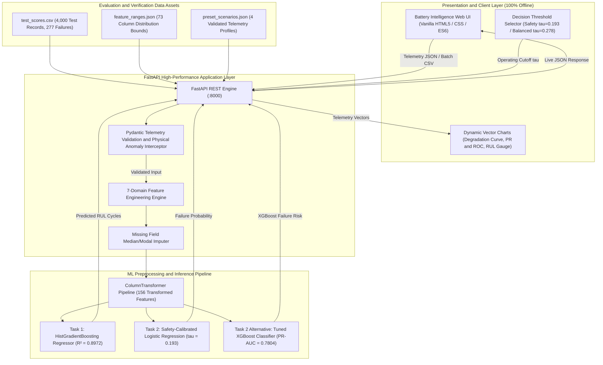

# EV Battery Prognostics & Health Management (PHM) System
**SLIIT IT3051 Fundamentals of Data Mining · Mini Project 2026**  
**Group Necrons** · Final Deliverable & Production Edge Deployment  

---

## 1. System Overview

The **EV Battery Prognostics & Health Management (PHM)** platform is a dual-task predictive maintenance system architected to monitor traction battery packs, forecast remaining cycle life, and provide early warnings for catastrophic electro-thermal failure.

```
+--------------------------------------------------------------------------------------------------+
|                                    DUAL-TASK PHM ARCHITECTURE                                    |
+--------------------------------------------------------------------------------------------------+
|  Task 1: Continuous Longevity Prognostics          Task 2: Critical Failure Early Warning        |
|  - Tuned HistGradientBoosting Regressor            - Safety-Calibrated Logistic Regression       |
|  - Test R²: 0.8972 (5-Fold CV)                     - Operating Threshold: τ = 0.193              |
|  - Test RMSE: 528.64 cycles (MAE: 423.11)          - Test Recall: 90.25% (250 / 277 caught)      |
|  - Baseline Floor: Dummy R² = -0.0015              - Precision: 64.27% (139 false alarms)        |
+--------------------------------------------------------------------------------------------------+
```

### Key Technical Achievements
- **Dual-Task Edge Inference:** Simultaneous continuous cycle regression and class-imbalanced failure probability estimation from a unified telemetry vector.
- **7 Domain-Engineered Features:** Physics-grounded interactions (thermal spread, efficiency gap, electrochemical wear index, C-rate proxy, impedance per 1,000 cycles, voltage dispersion, mechanical inrush stress).
- **Leakage-Free Preprocessing:** 156-feature `ColumnTransformer` fitted strictly on training folds with median/modal imputation, `RobustScaler` outlier protection, and `OneHotEncoder`.
- **Decoupled Architecture:** High-throughput **FastAPI Backend** serving a **100% Offline Vanilla HTML/CSS/JS Frontend** with zero external CDN or Node dependencies.
- **Streamlit Fallback:** Standalone legacy prototype (`app.py`) preserved untouched for presentation resilience.

---

## 2. System Architecture & Data Flow



---

## 3. Repository Structure

```
EV_Battery_project/
├── backend/
│   └── app/
│       ├── __init__.py           # Package initialization
│       ├── config.py             # Telemetry slider definitions & physical metadata
│       ├── main.py               # FastAPI application, CORS, and 11 REST endpoints
│       ├── pipeline.py           # Cached artifact loader, featurizer, validation, inference
│       ├── schemas.py            # Pydantic request/response validation schemas
│       └── thresholds.py         # Live confusion matrix, PR/ROC curves, fleet simulator
├── frontend/
│   ├── app.js                    # Vanilla ES6 application logic & hand-drawn SVG charts
│   ├── index.html                # Semantic responsive HTML5 user interface
│   └── styles.css                # Production CSS design system (White/Blue/Green/Navy)
├── models/
│   ├── champion_failure_lr.joblib    # Task 2 Champion: Calibrated Logistic Regression
│   ├── champion_failure_xgb.joblib   # Task 2 Tree Champion: Tuned XGBoost
│   ├── champion_rul_hgb.joblib       # Task 1 Champion: Tuned HistGradientBoosting
│   ├── feature_ranges.json           # 73-feature training distribution percentiles & IQR
│   ├── metadata.json                 # Model feature schema, categorical options, defaults
│   ├── preprocessor.joblib           # Fitted 156-feature ColumnTransformer
│   ├── preset_scenarios.json         # 4 verified telemetry profiles (RFC 8259 compliant)
│   └── test_scores.csv               # 4,000 held-out evaluation test predictions
├── notebooks/
│   ├── 01_data_audit_personA.ipynb
│   ├── 02_distributions_outliers_personB.ipynb
│   ├── 03_relationships_features_personC.ipynb
│   └── 04_pipeline_split_personD.ipynb
├── scripts/
│   └── export_test_scores.md     # Reproducible notebook snippet to export test assets
├── tests/
│   ├── test_api.py               # FastAPI TestClient endpoint integration tests (12 tests)
│   ├── test_pipeline.py          # Parity, physical consistency & unknown field tests (5 tests)
│   └── test_thresholds.py        # Threshold math, curve sweep & fleet simulation tests (4 tests)
├── app.py                        # Untouched Streamlit fallback prototype
├── requirements.txt              # Pinned Python package dependencies
├── run.bat                       # One-click Windows startup script
├── run.sh                        # One-click Linux/macOS startup script
└── README.md                     # System documentation & technical guide
```

---

## 4. Quick Setup & Execution

### Prerequisites
- Python 3.10, 3.11, 3.12, or 3.13
- Internet access is **not required** after initial `pip install` (100% offline operational guarantee).

### Installation
```bash
# 1. Clone repository
git clone https://github.com/chenuka10/EV_Battery_PHM.git
cd EV_Battery_PHM

# 2. Create and activate virtual environment
python -m venv .venv
# On Windows:
.\.venv\Scripts\activate
# On Linux/macOS:
source .venv/bin/activate

# 3. Install pinned dependencies
pip install -r requirements.txt
```

### Launching the Production Server (One Command)
**On Windows:**
```cmd
run.bat
```
**On Linux/macOS:**
```bash
chmod +x run.sh
./run.sh
```
**Manual Launch:**
```bash
uvicorn backend.app.main:app --host 0.0.0.0 --port 8000 --reload
```
Open **[http://localhost:8000](http://localhost:8000)** in any modern web browser.  
Interactive OpenAPI documentation is available at **[http://localhost:8000/docs](http://localhost:8000/docs)**.

### Fallback Streamlit Prototype
If needed during viva presentations:
```bash
streamlit run app.py
```

---

## 5. Verification & Test Suite

The automated test suite executes **21 tests** across unit, integration, and mathematical parity verifications in under 3 seconds:

```bash
pytest tests/ -v
```

### Test Suite Summary
| Test Module | Coverage & Verification Focus | Status |
|:---|:---|:---:|
| `test_pipeline.py::test_artifacts_loaded` | Confirms all 8 model, preprocessor, and schema artifacts exist | **PASS** |
| `test_pipeline.py::test_pipeline_parity_with_app` | Verifies backend predictions match reference pipeline ($<0.1$ cycles) | **PASS** |
| `test_pipeline.py::test_physical_validation_max_temp` | Validates rejection ($T_{\text{max}} < T_{\text{avg}}$) with HTTP 422 | **PASS** |
| `test_pipeline.py::test_unknown_fields_rejected` | Ensures unknown telemetry keys are caught and rejected | **PASS** |
| `test_pipeline.py::test_imputation_and_warning_reporting` | Verifies median imputation and collinearity warnings | **PASS** |
| `test_thresholds.py::test_threshold_math_reproduces_report`| Validates exact reproduction of Table 13 ($250$ TP, $27$ FN, $139$ FP) | **PASS** |
| `test_thresholds.py::test_curves_generation` | Verifies 91-step threshold sweep ($0.05$ to $0.95$) | **PASS** |
| `test_thresholds.py::test_operating_modes_derivation` | Validates Safety, Balanced, and Precision mode derivation | **PASS** |
| `test_thresholds.py::test_fleet_simulation` | Verifies fleet capacity, workload, and teardown scaling | **PASS** |
| `test_api.py::test_api_health` | Confirms `/api/health` reports status `ok` and artifact integrity | **PASS** |
| `test_api.py::test_api_meta` | Validates 73-feature schema, constants, and scenario presets | **PASS** |
| `test_api.py::test_api_predict_happy_paths` | End-to-end inference verification for Logistic and XGBoost | **PASS** |
| `test_api.py::test_api_predict_validation_error` | Negative testing for invalid types and schema violations | **PASS** |
| `test_api.py::test_api_threshold` | Live confusion matrix computation across evaluation test set | **PASS** |
| `test_api.py::test_api_modes` | Validates multi-mode operating policy retrieval | **PASS** |
| `test_api.py::test_api_simulate` | Validates depot capacity and technician workload endpoint | **PASS** |
| `test_api.py::test_api_explain` | Validates "Why this score" feature attribution vector | **PASS** |
| `test_api.py::test_api_sample_batch_and_batch_upload` | Verifies sample CSV generation, upload, and ranking | **PASS** |
| `test_api.py::test_api_leaderboard` | Confirms master leaderboards match Technical Report figures | **PASS** |
| `test_api.py::test_api_data_health` | Verifies dataset provenance, distribution bounds, and missingness | **PASS** |
| `test_api.py::test_api_selftest` | Executes end-to-end multi-scenario self-test diagnostic | **PASS** |

---

## 6. REST API Reference

| Endpoint | Method | Description |
|:---|:---:|:---|
| `/api/health` | `GET` | Health check, uptime, loaded artifacts status, and library versions |
| `/api/meta` | `GET` | Feature schemas, 12 slider bounds, verified scenarios, physical formulas |
| `/api/predict` | `POST` | Dual-task inference (RUL cycles + failure risk, status, alerts, warnings) |
| `/api/threshold` | `GET` | Live confusion matrix, precision, recall, F1, and PR/ROC curves |
| `/api/modes` | `GET` | Safety, Balanced F1, and Precision operating modes |
| `/api/simulate` | `POST` | Fleet breakdown prevention & technician inspection hours simulator |
| `/api/explain` | `POST` | Top contributing telemetry wear factors driving risk score |
| `/api/batch` | `POST` | Batch CSV upload, schema check, median imputation, and risk ranking |
| `/api/sample-batch` | `GET` | Download sample telemetry CSV for instant batch demo testing |
| `/api/leaderboard` | `GET` | Master evaluation leaderboards (Report Tables 8, 26, 28, 29) |
| `/api/selftest` | `GET` | Automated multi-scenario diagnostic executing live inference |

---

## 7. Team Contribution Matrix (SLIIT IT3051)

| Member | Focus Area | Technical Contributions | Viva Defense Expertise |
|:---|:---|:---|:---|
| **Person A** | Data Quality & Architecture | Telemetry schema audit, missingness characterization, sensor boundary validation ($V \le 0, T > 120^\circ\text{C}$), FastAPI structure. | Sensor anomaly bounds, missingness mechanisms, API error contract. |
| **Person B** | Distributions & Outliers | Univariate skewness analysis, RUL target distribution ($\mu=7,825.36$), IQR filtering, physical outlier retention. | Target normality, why extreme temperatures ($>72.98^\circ\text{C}$) are retained, IQR math. |
| **Person C** | Class Imbalance & Feature Eng. | Task 2 class imbalance ($13.45:1$), correlation analysis, derivation of the 7 domain-engineered interaction features. | Scale pos weight, collinearity handling ($|r|=1.0$), physical feature formulas. |
| **Person D** | Pipeline & Decision Modeling | Stratified train/test partition, `ColumnTransformer` (156 features), threshold optimization ($\tau=0.193$), champion models. | Data leakage prevention, precision-recall trade-offs, accuracy paradox. |

---

## 8. Academic Attribution & Disclaimer
This software is developed for **SLIIT IT3051 Fundamentals of Data Mining (Mini Project 2026)** by Group Necrons.  
**Disclaimer:** This software is a decision-support prototype built for research and educational evaluation. It does not constitute a certified automotive safety device or commercial battery management system (BMS).
